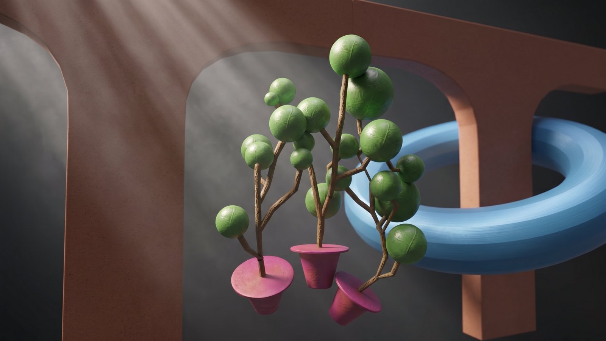

# Comfyder Lite

**AI-refine your Blender renders with one button — right inside Blender.**

> ⚠️ **Requires: a running [ComfyUI](https://github.com/comfyanonymous/ComfyUI) server + a [fal.ai](https://fal.ai) API key.**
> ComfyUI is only the orchestrator (CPU-only is fine) — all generation runs on FAL as paid API calls (typically a few cents per image).

Render → type a mood prompt → get a polished AI render back as a new image in Blender.
No node wrangling, no exports, UI never freezes.


*Raw viewport-color render → prompt: "hyperreal 4K render, soft cinematic light beams, atmospheric smoke" → one click.*

---

## How it works

```
Blender render ──► ComfyUI (your server) ──► fal.ai
     │                    │
     │              [VLM_fal]  Gemini vision describes the scene
     │                    │    and merges it with your mood prompt
     │                    ▼
     └─(depth map)─► [FalGeminiFlashEdit]  Gemini 3.1 edits the frame,
                          │                depth map as geometry reference
                          ▼
                   result appears in Blender as "Comfyder Result"
```

The add-on talks to ComfyUI over plain HTTP (`/upload/image`, `/prompt`, `/history`)
and polls in the background via `bpy.app.timers` — Blender stays responsive.

## Requirements

| What | Why |
|---|---|
| **ComfyUI** reachable over HTTP (localhost or LAN) | Orchestrator. Never samples locally — CPU box is fine |
| **[gokayfem/ComfyUI-fal-API](https://github.com/gokayfem/ComfyUI-fal-API)** custom nodes | `VLM_fal` (scene description) |
| **ComfyUI-FAL** (Image Edit pack) custom nodes | `FalGeminiFlashEdit` (the actual image edit) |
| **`FAL_KEY`** env var in the ComfyUI process | All generation is billed per call on [fal.ai](https://fal.ai) |
| **Blender 5.0+** | Add-on uses the 5.x compositor API for auto-depth |

## Install

1. Set up the ComfyUI side (node packs + `FAL_KEY`), note the server address.
2. In Blender: `Edit → Preferences → Add-ons → Install from Disk…` → select `addon/comfyder_lite.py` → enable.
3. In the panel, set your ComfyUI address (default `http://192.168.1.2:8188`).

## Usage

1. Press **F12** to render (or choose *Viewport* as source — an OpenGL snapshot of what you see).
2. In the render window press **N** → **Comfyder** tab.
3. Type a mood/style prompt — any language works, e.g.
   `4K hi-res render, добавить лучи света и атмосферный дым`.
4. **Generate**. Status is shown in the panel; ~30–90 s later the result
   loads as a new image **"Comfyder Result"** (switch images in the header).

### Panel reference

| Setting | Default | What it does |
|---|---|---|
| Prompt (✏ opens a wide editor) | — | Mood/style instruction merged into the generation |
| VLM-описание сцены | on | Gemini vision first describes your frame, then applies your mood on top — better scene fidelity |
| Источник: Рендер / Вьюпорт | Рендер | What to send: last F12 render or an OpenGL viewport snapshot |
| 1K / 2K / 4K | 2K | Output resolution |
| Seed | 7 | Fix it to iterate comparably |
| Прикладывать depth | off | Send a depth map as a second input — locks geometry much harder |
| Авто-рендер depth | on | Add-on renders a fresh Z-pass depth map itself (temporary compositor, your setup is restored). Note: replaces the Render Result preview; not available for *Viewport* source |
| Depth PNG | — | Manual depth file (used when auto is off) |
| ComfyUI | `http://…:8188` | Server address |

### Tips

- **Depth on** = geometry survives aggressive restyling. Best combo: *Рендер* + auto-depth.
- The VLM describes **what it sees** — if your render is grey clay, say what things should become in the prompt.
- Same seed + same inputs ≠ pixel-identical results (FAL backends are not deterministic). Keep good results — regenerating "the same" costs another call.
- *Viewport* source sends everything visible in the viewport, gizmos included — fly to camera view (`Numpad 0`) first.

## Advanced: full zone-based pipeline (Blocking2Render)

This repo also ships the full pipeline the add-on grew out of: rough blocking
with placeholder materials → depth ControlNet global pass → **per-material
AI passes via Cryptomatte masks** (brick / water / flowers each with its own
prompt, engine and mask softness) → final refine.


- `blender/setup_passes.py` — renders `depth.png` + one mask per `mat_*` material (dilate/blur baked in)
- `driver/comfy_graph_v2.py` — graph builder; per-zone engines: `fill`, `qwen` (strength+negative), `gemini_zone`, `kontext_zone`, reference swatches, procedural light `overlay`
- `driver/run.py` + `driver/materials.yaml` — config-driven runner
- [docs/Blocking2Render.md](docs/Blocking2Render.md) — field notes: 20 battle-tested rules (mask sizes, engine choice per zone type, aspect-ratio traps, pinning against non-determinism)

## Roadmap

- v0.2: result history with **Pin** (iterate from any kept frame), prompt presets
- Full Comfyder: the zone pipeline driven from the N-panel — materials list with per-zone prompts, engines and mask sliders

## License

[MIT](LICENSE) © 2026 Stepan Vladovskiy
